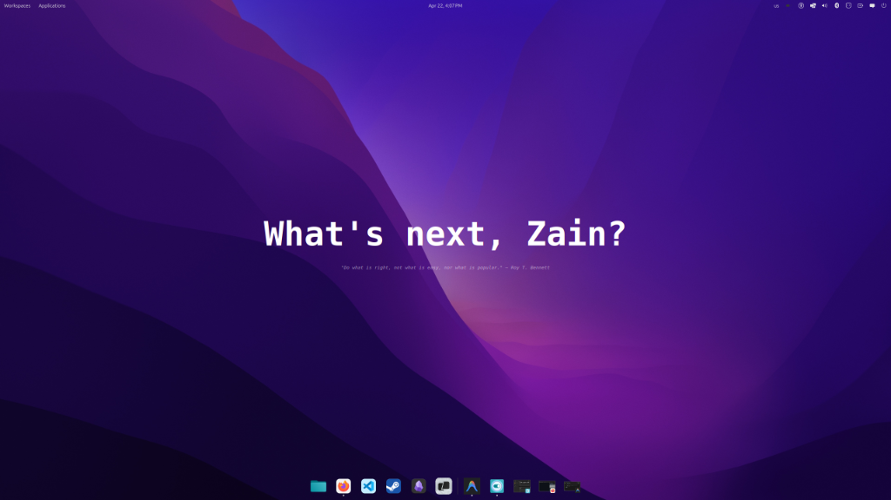

# eww-widgets

A collection of modular [Eww](https://github.com/elkowar/eww) widgets for Linux desktops.

Each module is self-contained — run it independently with its own `eww -c` config.




---

## Modules

### [clock-module](./clock-module)
A Rainmeter BC-lock inspired block clock. Five overlapping semi-transparent progress bars represent hours, minutes, seconds, month, and day — each sweeping in from a different direction. Fully themeable via SCSS variables.

### [stats-module](./stats-module)
System stats widget displaying CPU, RAM, GPU usage, CPU temperature, and local weather as vertical circular indicators.

### [greeting-module](./greeting-module)
A centered greeting widget with time-aware phrases (80+ across 5 time buckets) and a daily quote filtered to science, philosophy, politics, history, and technology topics.

---

## Requirements
- [Eww](https://github.com/elkowar/eww) (ElKowar's Wacky Widgets)
- `bash`, `date` (standard on all Linux systems)
- `curl` (for greeting-module quote fetching)
- `Roboto Mono` font (optional but recommended)

---

## Usage

Each module runs independently:

```bash
# Block clock
eww -c ~/Desktop/eww-widgets/clock-module open-many time-hour time-min time-sec date-month date-day

# Stats
eww -c ~/Desktop/eww-widgets/stats-module open stats-widget

# Greeting
eww -c ~/Desktop/eww-widgets/greeting-module open greeting
```

---

## License
MIT
